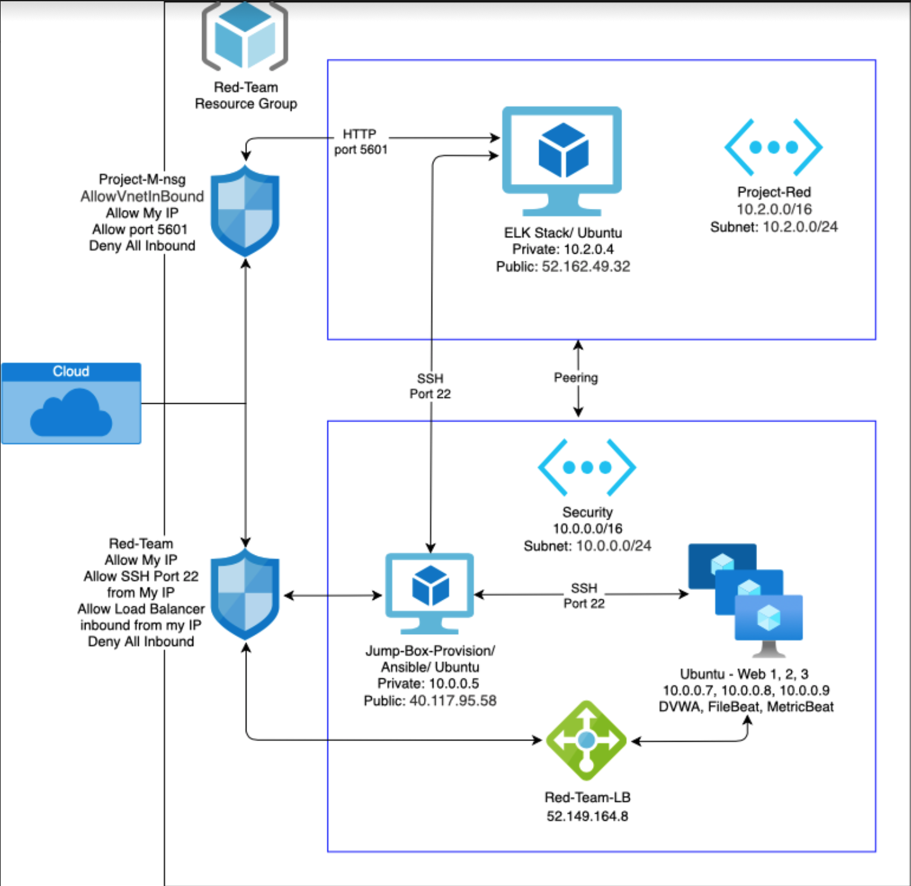

## Automated ELK Stack Deployment

The files in this repository were used to configure the network depicted below.

These files have been tested and used to generate a live ELK deployment on Azure. They can be used to either recreate the entire deployment pictured above. Alternatively, select portions of the _____ file may be used to install only certain pieces of it, such as Filebeat.

  - _TODO: Enter the playbook file._

This document contains the following details:
- Description of the Topologu
- Access Policies
- ELK Configuration
  - Beats in use
  - Machines being monitored
- How to Use the Ansible Build

### Description of the Topology

The main purpose of this network is to expose a load-balanced and monitored instance of DVWA, the D*mn Vulnerable Web Application.

Load balancing ensures that the application will be highly available, in addition to restricting access to the network.

Integrating an ELK server allows users to easily monitor the vulnerable VMs for changes to the log files and system resources.

The configuration details of each machine may be found below:

| Name                 | Function  | IP Address | Operating System |
|----------------------|-----------|------------|------------------|
| Jump Box Provisioner | Gateway   | 10.0.0.5   | Linux            |
| Web 1                | Server    | 10.0.0.8   | Linux            |
| Web 2                | Server    | 10.0.0.7   | Linux            |
| Web 3                | Server    | 10.0.0.9   | Linux            |
| Project-M            | Elk Stack | 10.2.0.4   | Linux            |

### Access Policies

The machines on the internal network are not exposed to the public Internet. 

Only the Jump Box Provision machine can accept connections from the Internet. Access to this machine is only allowed from the following IP addresses:
- 24.171.78.243

Machines within the network can only be accessed by the Jump Box Provision:
- Internal IP: 10.0.0.5
- Public IP: 40.117.95.58

A summary of the access policies in place can be found in the table below.

| Name               | Public Accessibility | Allowed IP Addresses                        |
|--------------------|----------------------|---------------------------------------------|
| Jump Box Provision |     Yes (SSH 22)     | 24.171.78.243, 10.0.0.7, 10.0.0.8, 10.0.0.9 |
| Web 1              |          No          | Load Balancer: 52.149.164.8                 |
| Web 2              |          No          | Load Balancer: 52.149.164.8                 |
| Web 3              |          No          | Load Balancer: 52.149.164.8                 |
| Load Balancer      |     Yes - Port 80    | *                                           |
| Project-M (ELK)    |          Yes         | 10.0.0.5                                    |
| -Kibana            |    Yes - Port 5601   | 174.86.25.39                                |
| -Elastic Search    |    Yes- Port 9200    | 174.86.25.39                                |

### Elk Configuration

Ansible was used to automate configuration of the ELK machine. No configuration was performed manually, which is advantageous because it allows you to simultaneously perform multiple steps via the automation.

The playbook implements the following tasks:
- Install docker 
- Download image
- Launch and configure the ELK stack 

The following screenshot displays the result of running `docker ps` after successfully configuring the ELK instance.

(Images/docker_ps.png)

### Target Machines & Beats
This ELK server is configured to monitor the following machines:
- 10.0.0.7
- 10.0.0.8
- 10.0.0.9
- 10.2.0.4

We have installed the following Beats on these machines:
- FileBeat
- MetricBeat

Using the following command to download the filebeat-config.yml:
curl https://gist.githubusercontent.com/slape/5cc350109583af6cbe577bbcc0710c93/raw/eca603b72586fbe148c11f9c87bf96a63cb25760/Filebeat > /etc/ansible/filebeat-config.yml

These Beats allow us to collect the following information from each machine:
- FileBeat automates the process of forwarding and centralizing log data on our Kibana site. This gives us a more intuitive interface to be able to see log data in various charts. You can click here for an example of the data provided.
- Meanwhile, MetricBeat automates the system resource data in similar charts. This could potentially allow us to prevent an attack that would generate a spike in resources used, such as DDoS.

### Using the Playbook
In order to use the playbook, you will need to have an Ansible control node already configured. Assuming you have such a control node provisioned: 

SSH into the control node and follow the steps below:
- Copy the elk_install.yml file to /etc/ansible/roles/elk_install.yml.
- Update the hosts file to include the attribute, followed by <IP address> ansible_python_interpreter=/usr/bin/python3.
- Run the playbook, and navigate to "http://<you ELK ip>:5601/app/kibana#/home" to check that the installation worked as expected.

Run the command <ansible-playbook /etc/ansible/roles/filebeat_playbook.yml> to download the playbook, update the files, etc.